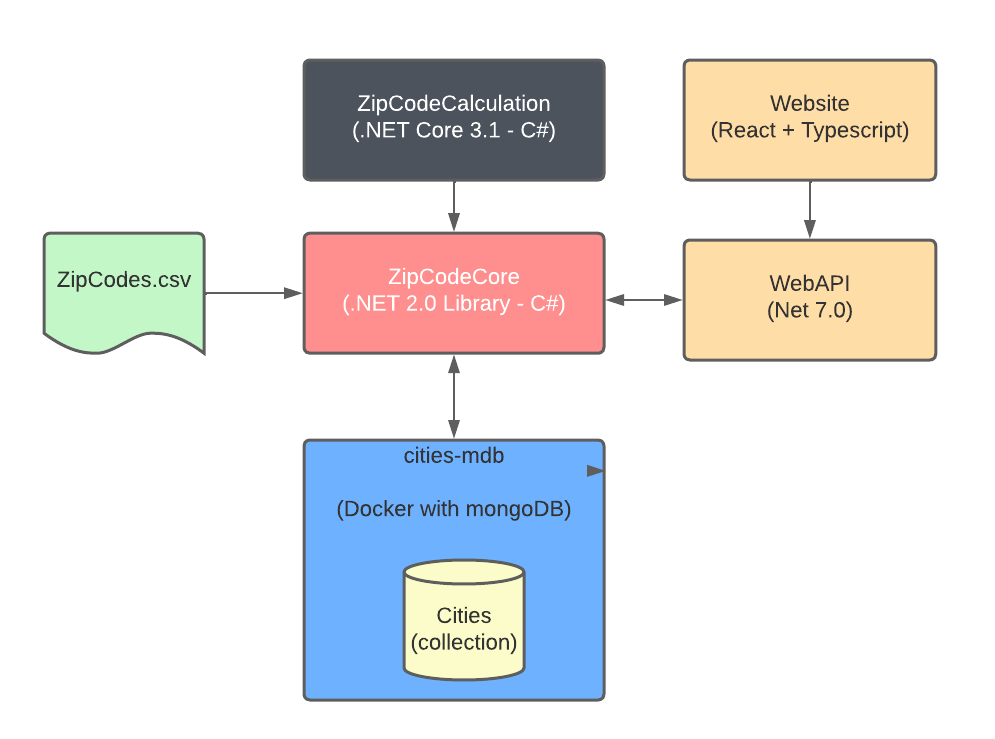
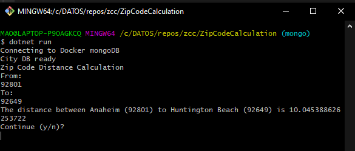
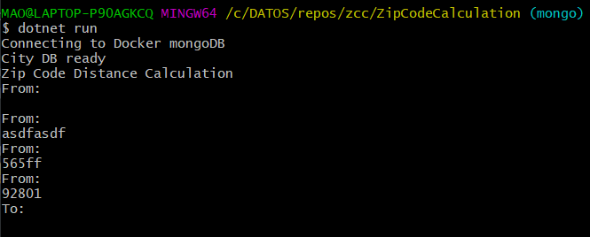
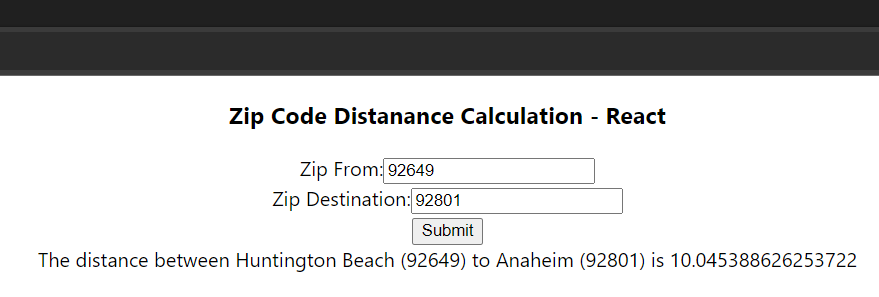
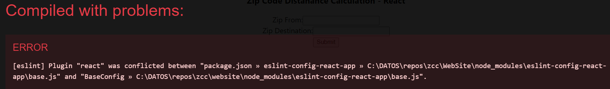

# Zip Code Calculation - ZCC

## Architecture Diagram

This solution has four projects:

1. `ZipCodeCode` is a library with the logic to perform the zipcode distance calculation, is implemented in .NET Core 2.0 so
   that it can be used from .NET Core and .NET Framework.

    This project takes care of loadingZipCodeCode the CSV file and storing it in a collection on a MongoDB that is inside a docker instance

2. `ZipCodeCalculation/Console` is a `C#` Console application that uses the `ZipCodeCode` library to read the two zipcodes and shows the distance

3. `WebAPI` is a REST api, that uses the `ZipCodeCode` library to provide a GET method that returns a JSON with the calculation results

4. `WebSite` is a ASP.NET + react website with a form to input the zipcodes, that calls the `WebAPI`, and shows the calculation results

## Requirements

1. Use the above diagram to determine the framework and runtime versions that you need for each project
1. Make sure the docker dameon is running (Windows run `Docker Desktop`, Linux run `dockerd`)
   for both the Environment Setup or running the Console or WebSite apps

## Environment Setup

To prepare the Docker image Run these commands from a commandline (CMD, Powershell, dont use gitbash since step 3 will fail)

1. `docker pull mongo`
1. `docker run -d -p 27017:27017 --name cities-mdb mongo`
1. `docker exec -it cities-mdb /bin/bash`
1. `mongosh`
1. `use clients-db`
1. `db.createCollection('Cities')`

## How to run All At Once

If you open the ZipCodeCalulation.sln in Visual Studio, you can just click on START button this will launch these projects in order

-   Console
-   WebApi
-   WebSite

## How to run Console application

1. Make sure the docker instance created above is running
1. Go to the `zcc/Console`
1. `dotnet build`
1. `dotnet run`
    

    Running the console application look like this  
     
    When the calculation is done you can try another one by pressing `y`

    The zipcode is validated to check for empty and non numeric values,  
    

## How to run Website

1. Run the `WebAPI` project (from the zcc/WebAPI folder)
2. Run the `React` web site (from the WebSite folder using Visual Studio or using the command line)

  
If you get this error while running the website 
 
you need to SAVE the file `package.json` to fix it (Visual Studio issue)
