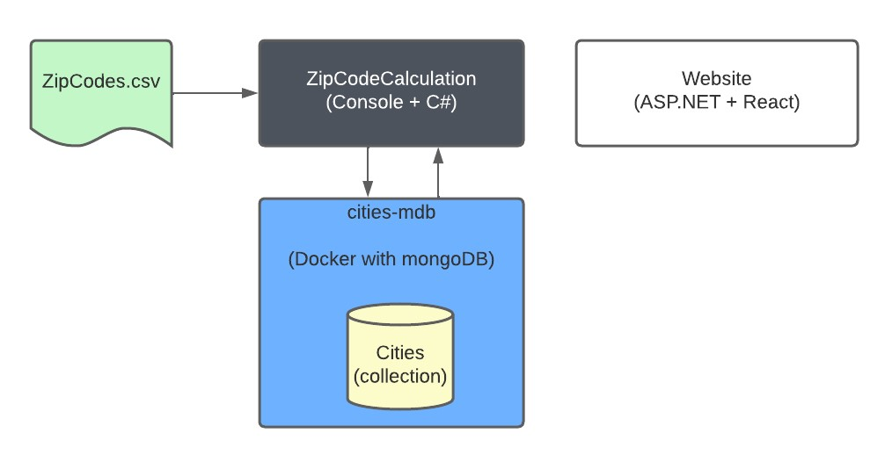
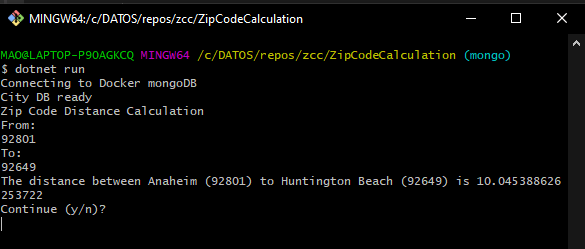
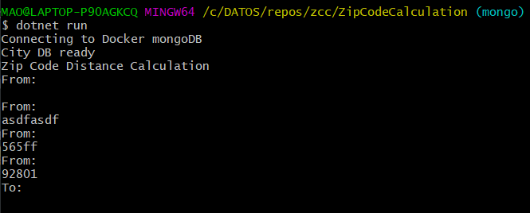

# Zip Code Calculation - ZCC

## Architecture Diagram

This solution has two projects:

**ZipCodeCalculation** is a `C#` Console application that reads the `ZipCodes.csv` and stores the data into a `MongoDB docker` image in a database called `cities-mdb`

**WebSite** is a ASP.NET + react website, currently is just a form to input the zipcodes but is not using the logic from `ZipCodeCalculation`

## Requirements

### Console

-   .NET CORE 3.1 Runtime
-   Docker

### Website

-   .NET 6.0 Runtime
-   React

## Environment Setup

To prepare the Docker image Run these commands from a commandline (CMD, Powershell, dont use gitbash since step 3 will fail)

1. `docker pull mongo`
2. `docker run -d -p 27017:27017 --name cities-mdb mongo`
3. `docker exec -it cities-mdb /bin/bash`
4. `mongosh`
5. `use clients-db`
6. `db.createCollection('Cities')`

## How to run Console application

1. Go to the `zcc/ZipCodeCalculation`
2. `dotnet run`
    

    Running above command show look like this  
    

    The zipcode is validated to check for empty and non numeric values, when the calculation is done you can try another one by pressing `y`
    

## How to run Website (react asp.net)

    - React + Netversion
